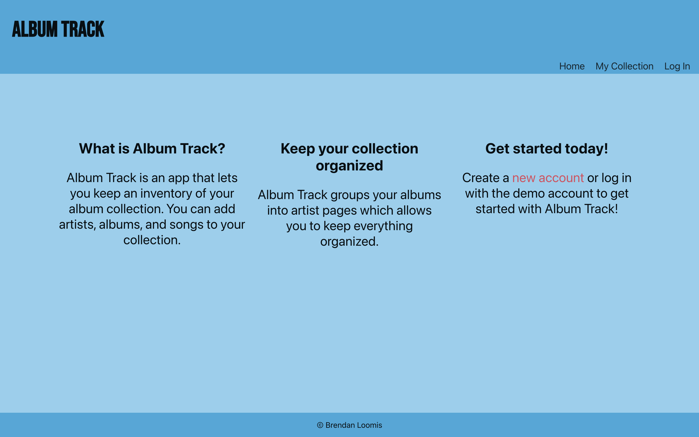
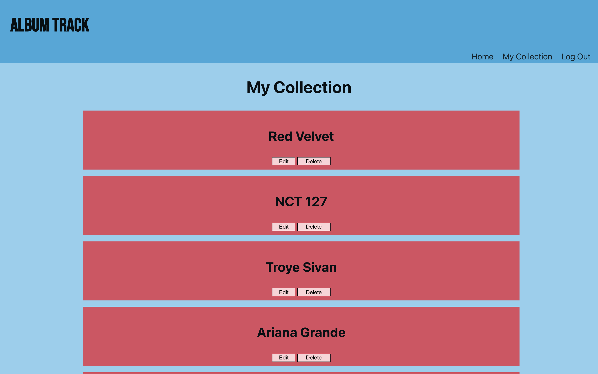
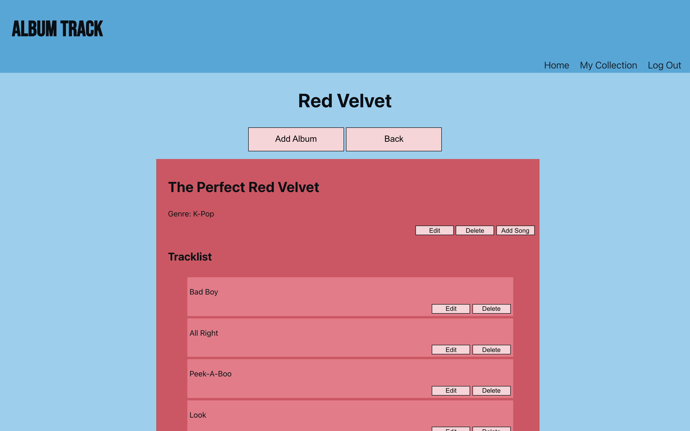
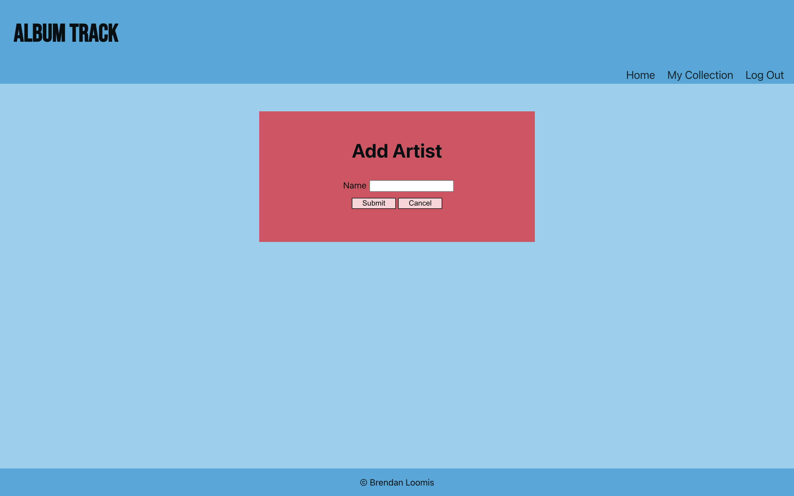
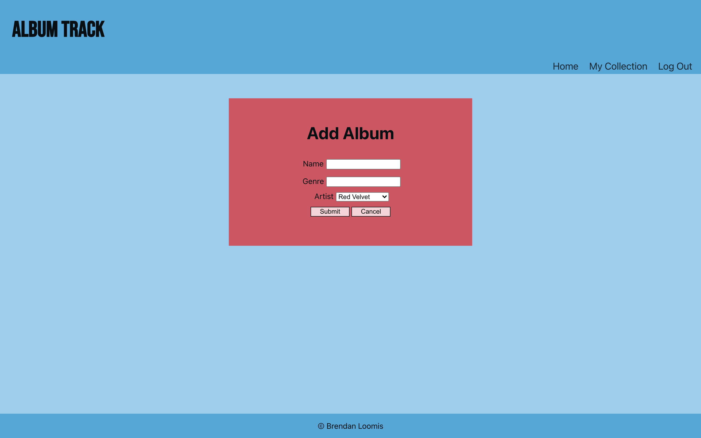
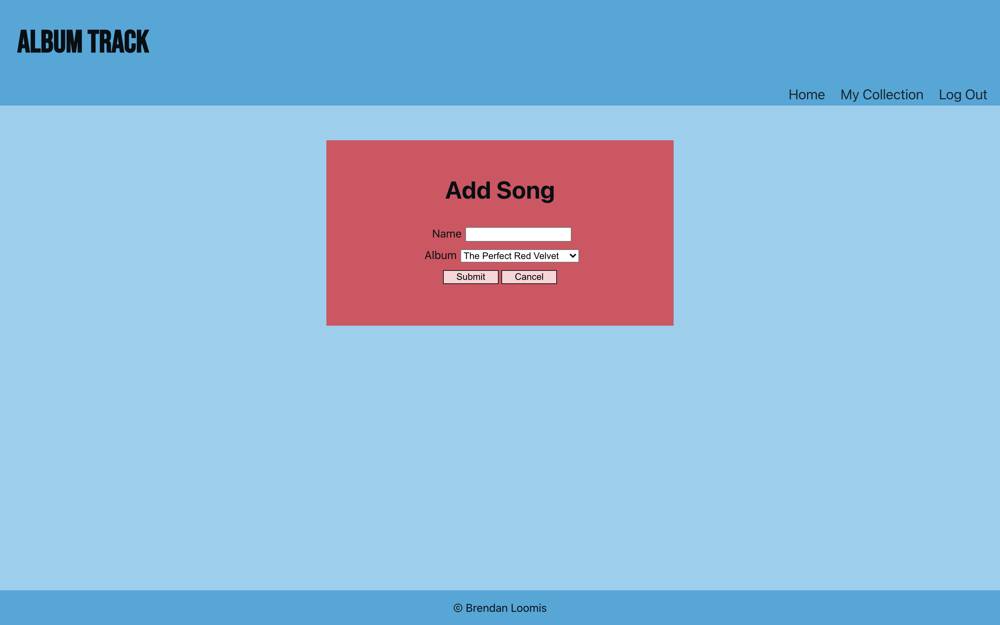

# Album Track
https://album-track.vercel.app/

An app that you can use to keep track of your album collection.

## API Documentation
https://github.com/brendanloomis/album-track-api/

## Summary

Album Track is an application that can be used for music collectors to keep track of the albums that they own. Users can add artists, albums, and songs to their collection. Users can also edit information for the artists, albums, and songs, and delete them from their collection. There is a demo account to try the app out (username: demo, password: password123).

## Screenshots
Landing Page:

Collection Page:

Artist Page:

Add Artist Page:

Add Album Page:

Add Song Page:

## Technology Used
* Front-End: 
    * React
    * JavaScript
    * HTML
    * CSS
    * Jest
    * Deployed with Vercel

* Back-End:
    * Node
    * Express
    * PostgreSQL
    * Mocha
    * Chai
    * Supertest
    * Deployed with Fly.io
